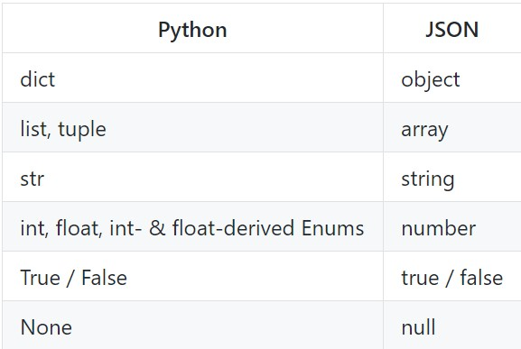

# Python100 - Day11

### 文件的读写

通过Python内置的open函数，可以指定文件名、操作模式、编码信息等来获得操作文件的对象。操作模式包括：1）打开什么样的文件（字符文件还是二进制文件）、2）做什么样的操作（读、写、追加）。

#### 读取文本文件

读取文本文件时，需要在使用open函数时指定好带路径的文件名（可以使用相对路径或绝对路径）并将文件模式设置为'r'，然后通过encoding参数指定编码。

在读取文件的过程中，如果找不到这个文件就会引发FileNotFindError；如果指定了未知的编码就会引发LookupError；如果读取文件时无法按照指定方式解码就会引发UnicodeDecodeError。

使用try-except-finally可以增强鲁棒性。把正常情况下想要实现的代码放在try下面，然后通过except来捕获可能会出现的异常情况，最后finally部分放无论程序正常还是异常都会执行的代码。

	def main():
		try:
			with open('a_story.txt', 'r', encoding='utf-8') as f:
				print(f.read())
		except FileNotFoundError:
			print('无法打开指定文件')
		except LookupError:
			print('指定了未知编码')
		except UnicodeDecodeError:
			print('读取文件解码错误')

	if __name__ == '__main__':
		main()

除了使用文件对象的read方法读取文件之外，还可以使用for-in循环逐行读取或者用readlines方法将文件按行读取到一个列表容器中。

	import time
	
	def main():

    	# 一次性读取整个文件内容
    	with open('story.txt', 'r', encoding='utf-8') as f:
    	    print(f.read())

    	# 通过for-in循环逐行读取
    	with open('story.txt', 'r', encoding='utf-8') as f:
    	    for line in f:
    	        print(line, end='')
    	        time.sleep(0.5)
    	print()

    	# 读取文件按行读取到列表中
    	with open('story.txt', 'r', encoding='utf-8') as f:
    	    lines = f.readlines()
    	print(lines)
    

	if __name__ == '__main__':
    	main()

#### 写入文本文件

将文本信息写入文件，需要在使用open函数时指定好文件名并将文件模式设置为'w'。如果需要对文件内容进行追加式写入，模式应该设置为'a'

如果指定要写入的文件不存在，会自动创建文件（不会引发异常）。

	from math import sqrt

	# is_prime函数的返回结果是True或者False
	def is_prime(n):
		assert n > 0
		for factor in range(2, int(sqrt(n)) + 1):
			if n % factor == 0:
				return False
		return True if n != 1 else False

	'''
	将1-9999直接的素数分别写入三个文件中
	1-99之间的素数保存在a.txt中
	100-999之间的素数保存在b.txt中
	1000-9999之间的素数保存在c.txt中
	'''

	def main():
		filenames = ('a.txt', 'b.txt', 'c.txt')
		fs_list = []  #创建一个空列表
		try:
			for filename in filenames:
				fs_list.append(open(filename, 'w', encoding='utf-8')) #将文本文件打开，作为一个元素加入fs_list中
				print(fs_list)
			for number in range(1,10000):
				if is_prime(number):
					if number < 100:
						fs_list[0].write(str(number) + '\n') #写入对应的文本文件中
					elif number < 1000:
						fs_list[1].write(str(number) + '\n')
					else:
						fs_list[2].write(str(number) + '\n')
		except IOError as ex:
			print(ex)
			print('写文件时发生错误')
		finally:
			for fs in fs_list:
				fs.close
		print('操作完成')

	if __name__ == '__main__':
		main()

#### 读写二进制文件

复制图片文件：

	def main():
		try:
			with open('wechat.jpg', 'rb') as fs_r:
				data = fs_r.read()
				print(type(data))
			with open('wechat.jpg', 'wb') as fs_w:
				fs_w.write(data)
		except FileNotFoundError as e1:
			print('指定文件无法打开')
		except IOError as e2:
			print('文件读写出现错误')

	if __name__ == '__main__':
		main()

#### 读写JSON文件

JSON：JavaScript Object Notation。如果希望把**一个列表或者一个字典**中的数据保存到文件中，可以将数据以JSON格式进行保存。

一个简单的JSON例子：

	{
	    'name': '骆昊',
	    'age': 38,
	    'qq': 957658,
	    'friends': ['王大锤', '白元芳'],
	    'cars': [
	        {'brand': 'BYD', 'max_speed': 180},
	        {'brand': 'Audi', 'max_speed': 280},
	        {'brand': 'Benz', 'max_speed': 320}
			]
	}

JSON的数据类型和Python的数据类型之间存在对应关系：

	import json

	def main():
		mydict = {
			'name' : '老王',
			'age' : 22,
			'qq' : 914932028,
			'friends' : ['老陈', '老李'],
			'cars' : [
				{'brand':'BYD', 'max_speed':180},
					{'brand':'AUDI', 'max_speed':280},
				{'brand':'Benz', 'max_speed':320}]
		}
		try:
			with open('data.json', 'w', encoding='utf-8') as fs:
				json.dump(mydict, fs) #使用python中的json模块就可以将字典或列表以JSON格式保存到文件中
		except IOError as e:
			print(e)
		print('保存数据完成')

	if __name__ == '__main__':
		main()

json模块四个比较重要的函数：

+ dump - 将Python对象按照JSON格式序列化到文件中
+ dumps - 将Python对象处理成JSON格式的字符串
+ load - 将文件中的JSON数据反序列化成对象
+ loads - 将字符串的内容反序列化成Python对象

#### 序列化与反序列化

+ 序列化（serialization）：将数据结构或对象的状态转换为可以存储或传输的形式，常见的序列化格式：二进制格式，字节数组，json字符串，xml字符串。在需要的时候能够通过序列化的数据重新获取字节，利用这些字节来产生原始对象的副本（拷贝）。
 
+ 反序列化（deseriallization）：将序列化的数据恢复为对象的过程。通过序列化的数据重新获取字节，利用这些字节来产生原始对象的副本（拷贝）。

目前绝大多数网络数据服务（或称之为网络API）都是基于HTTP协议提供JSON格式的数据，如果我们要对一个对象进行传输，应该先将对象进行序列化，然后通过网络进行传输，当到达目的地后，再进行反序列化获取到我们想要的对象，完成通信。

> 一个类比的例子：在淘宝上买衣柜这种不规则的东西，如果要跨城市运输，就需要把它拆掉成板子（每块板子甚至可以编号），然后可以快递寄出去了，这可以类比**序列化**的过程（把数据转化为可以存储或者传输的形式）。买家接收到板子后需要配合说明书中对于编号的说明，把这些板子组装成在店家原来的衣柜的样子，这可以类比**反序列化**的过程（转化成原始对象的副本）。
