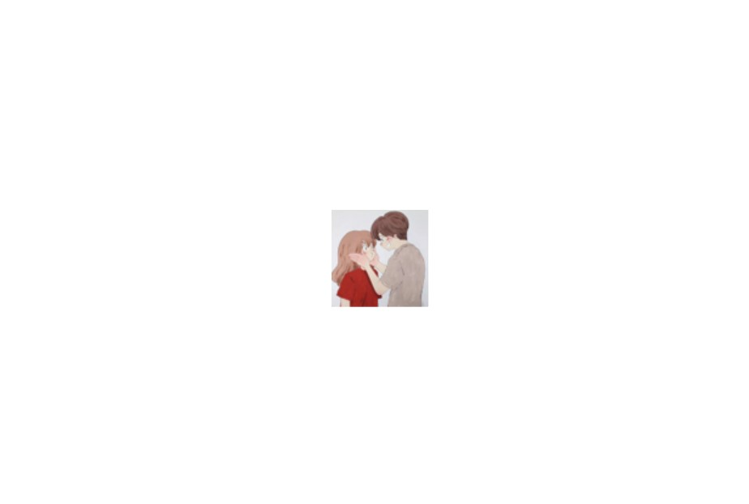
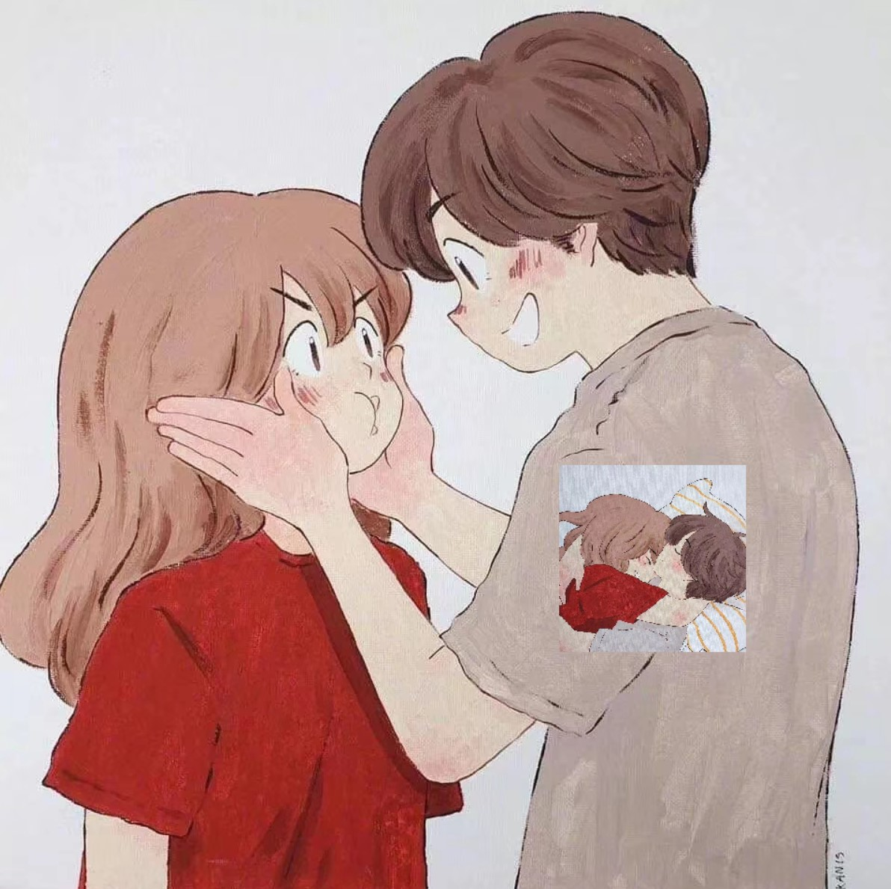
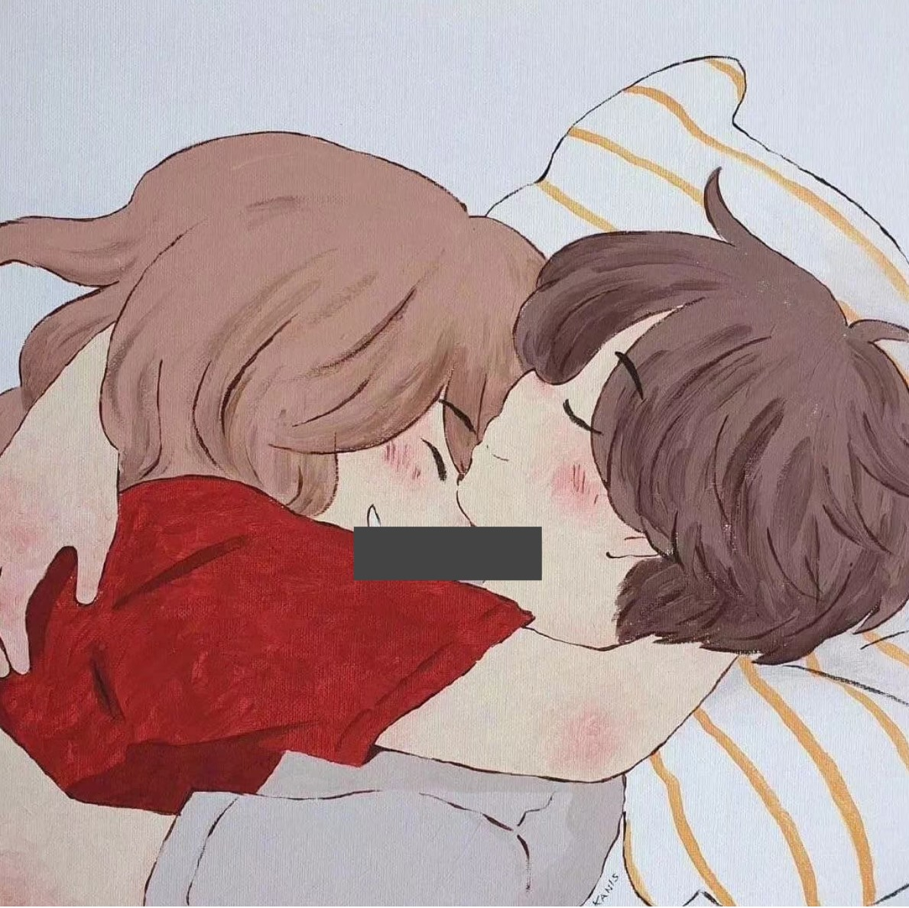

# Python100 - Day15
## 图像和办公文档处理

### 操作图像

#### 颜色与像素基础

计算机中，以红、绿、蓝为基础，通过设置RGB值或RGBA值（其中的A表示Alpha通道，它决定了透过这个图像的像素，也就是透明度）可以调出想要的颜色。

**颜色**

| 名称 | RGBA值 | 名称 | RGBA值 |
| :------: | :------: | :------: | :------: |
| White | (255,255,255,255) | Black | (0,0,0,255) |
| Red | (255,0,0,255) | Yellow | (255,255,0,255) |
| Green | (0,255,0,255) | Gray | (128,128,128,255) |
| Blue | (0,0,225,255) | Purple| (128,0,128,255) |

#### 用Pillow操作图像

如果没有pillow这个包需要先pip install pillow
 
	from PIL import Image

	image = Image.open('./picture.jpg')
	print(image.format, image.size, image.mode) #JPEG (960, 960) RGB
	image.show()

	# 用crop对图像进行裁剪，规定左上角的坐标(100，10)以及右下角的坐标(760，600)
	rectangle = 100, 10, 760, 600 
	image.crop(rectangle).show() 

	# 用thumbnail生成缩略图，规定size为(128,128)
	size = 80, 80
	image.thumbnail(size)
	image.show()

	

	# 用resize缩放并用paste黏贴图像
	image1 = Image.open('./picture1.jpg')
	image2 = Image.open('./picture.jpg')
	rect = 700, 600, 900, 800   #获取男孩心脏的位置
	# image2.crop(rect).show()  
	heart = image2.crop(rect) #截出男孩心脏的图片方便测量大小供图片resize
	# width, height = heart.size 
	image2.paste(image1.resize(heart.size), (600, 500))
	image2.show()

	

	# 用rotate旋转、transpose翻转
	image1.show()
	image1.rotate(180).show() #顺时针旋转180度
	image1.transpose(Image.FLIP_LEFT_RIGHT).show() #左右翻转

	# 用putpixel操作像素
	for x in range(400, 610):
		for y in range(600, 660):
			image1.putpixel((x, y), (68, 68, 68))
	image1.show()

	# 用filter加滤镜效果
	image = Image.open('./picture.jpg')
	image.filter(ImageFilter.CONTOUR).show()

### 处理Excel表格

openpyxl模块：Python程序中读取和修改Excel电子表格

### 处理Word文档

python-docx模块：创建和修改Word文档

### 处理PDF文档

待更新