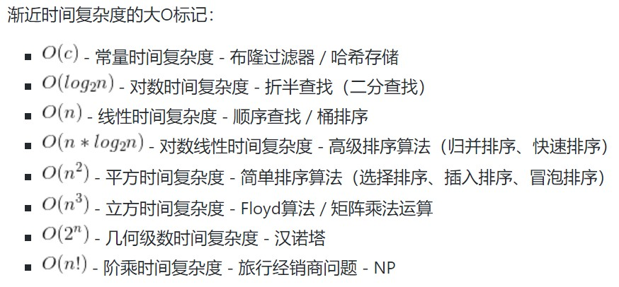

# Python100 - Day16
## Python语言进阶

**小目录**

+ 数据结构的算法
+ 函数的使用方式
+ 面向对象相关知识
+ 迭代器和生成器
+ 并发编程

### 1.数据结构和算法

算法可以理解为**解决问题的方法和步骤**，评价算法从**渐进时间复杂度和渐进空间复杂度**进行。

学到这里的时候，最多是能通过循环的层数区别n的几次方，所以要继续加把劲学，把这些都搞懂~~~

#### 排序算法（选择、插入、冒泡和归并）

+ 选择排序

选择排序的算法：先设置minIndex为i，对应值为list[i]，然后，从i+1开始往后遍历找出最小的值，并将minIndex设置为该值的位置，最后将i位置与minIndex位置的数值互换，就得到第i大的值
	
	a = [6,5,4,3,2,1,10,8,9,8.1]
	
	def selectionSort(list):
		for i in range(len(list)):
			minIndex = i
			for j in range(i+1, len(list)):
				if list[j] < list[minIndex]:
					minIndex = j
			list[i], list[minIndex] = list[minIndex], list[i]
	
		print(list)
	
	selectionSort(a)

+ 插入排序

插入排序的算法：一组数据视作分成两组，分别为有序组与待插入组，每次从待插入组中取出一个元素，与有序组的元素进行比较，找到合适的位置，插到有序组当中。

插入过程中涉及到了元素的移动，有不同的方式。以下，insertionSort1是待插入数一边移动一边比较，直到所在位置比前一个数大（多次插入），insertionSort2是先将待插入数赋给新变量，先比较好、移动出空位在插入（一次插入）

	a = [6,5,4,3,2,1,10,8,9,8.1]
	
	def insertionSort1(list):
		for i in range(1, len(list)):
			for j in range(i, 0, -1):
				if list[j] < list [j-1]:
					list[j], list[j-1] = list[j-1], list[j]
				else: 
					break
		print(list)
	
	insertionSort1(a)
	
	def insertionSort2(list):
		for i in range(1, len(list)):
			ins = list[i] 
			for j in range(i, 0, -1):
				if list[j-1] > ins:
					list[j] = list[j-1]
				else:
					list[j] = ins
					break
		print(list)
	
	insertionSort2(a)

+ 冒泡排序
+ 归并排序

